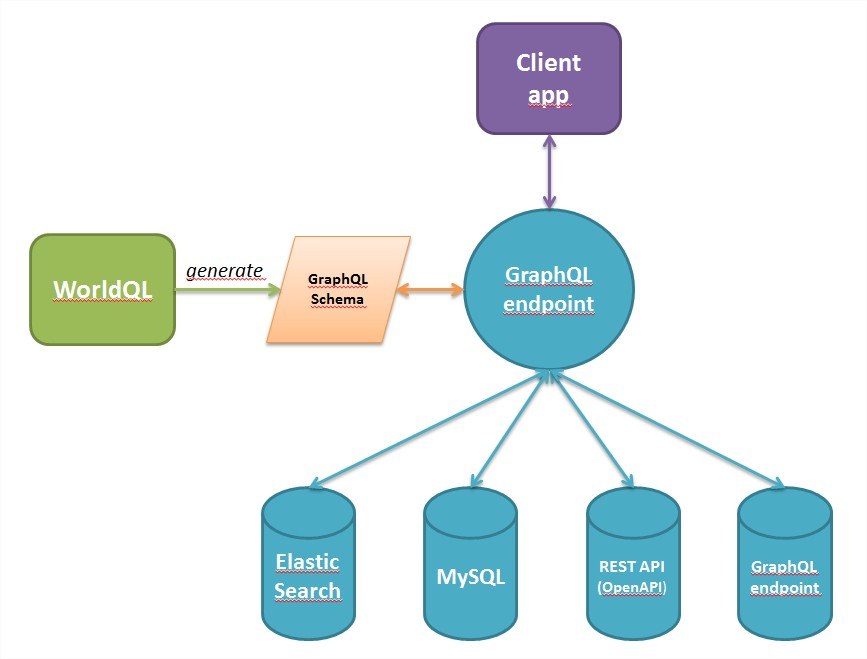

# WorldQL

**Want to query the world with GraphQL ?** 
Search no more, you have found **the right NodeJS library** !

WorldQL allows you to **merge and stitch all yours datasources into a single GraphQL endpoint.**

# Providers supported

|                  |Third-party library used       |
|------------------|-------------------------------|
|GraphQL	   |[apollo-link-http](https://github.com/apollographql/apollo-link)|
|MySQL        |graphql-compose-mysql (soon published) |
|ElasticSearch     | [graphql-compose-elasticsearch](https://github.com/graphql-compose/graphql-compose-elasticsearch)            |
|OpenAPI (REST API)|[oasgraph](https://github.com/strongloop/oasgraph)|

## What it does ?

##  How it works ?

### 1. Declare your datasources in JS

    const worldql = require("./worldql-core")
    const wqlConf = {
                sources: {
                    petstore: {
                        url: "http://localhost:8085/api-docs",
                        type: "OPEN_API",
                        converter: "OASGRAPH"
                    },
                    books: {
                         url: "http://localhost:8090",
                         type: "GRAPHQL",
                    },
                    company: {
                         type: 'ELASTICSEARCH',
                         url: 'http://localhost:9200',
                         graphqlTypeName: "company",
                         elasticIndex: 'companydatabase',
                         elasticType: 'employees',
                         pluralFields: ['skills', 'languages'],
                         apiVersion: '5.6',
                    },
                    employees: {
                        type: "MYSQL",
                        host: "localhost",
                        port: "3306",
                        user: "root",
                        password: "secret",
                        database: "employees",
                        mysqlTableName: "employees",
                        graphqlTypeName: "employeesT",
                    },
                },
            }
### 2. Add some stitching between them (or not)

    const worldql = require("./worldql-core")
    const wqlConf = {
                sources: {
                    ...
                },
                stitches: [
                    {
                        parentType: "employeesT",
                        fieldName: "petOfEmployee",
                        fieldType: "viewerApiKey",
                        resolver: {
                            source: "petstore",
                            query: "viewerApiKey",
                            params: {
                                static: {},
                                fromParent: { apiKey: "first_name", },
                            }
                        }
                    },
                ]
            }
### 3. Generate a GraphQL schema with WorldQL

        const worldql = require("./worldql-core")
        const wqlConf = { ... }
        worldql.buildGqlSchema(wqlConf).then(gqlSchema => {
                    ...
        })
### 4. Profit !!! (With apollo-server for exemple)

    const worldql = require("./worldql-core")
    const wqlConf = { ... }
    worldql.buildGqlSchema(wqlConf).then(gqlSchema => {
              const server = new ApolloServer({
    		schema: gqlSchema,
    		playground: true,
    	})
    	server.listen().then(({ url }) => {
	                console.log(`🚀 Server ready at ${url}`)
    	})
    })
